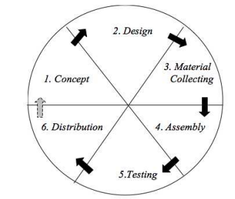
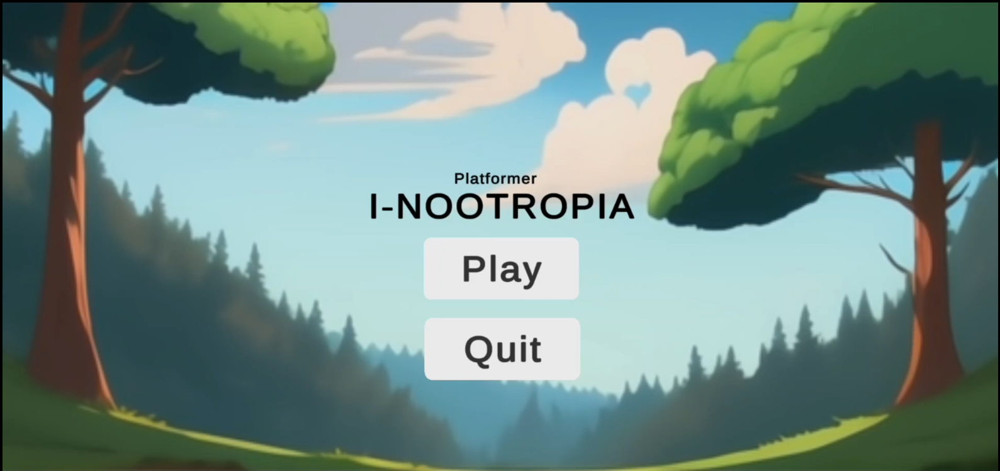
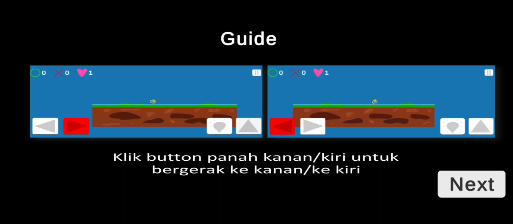
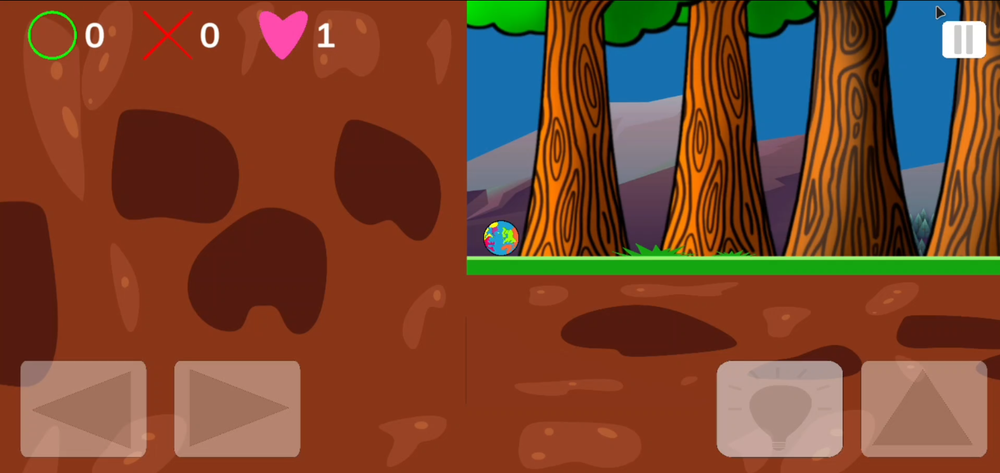
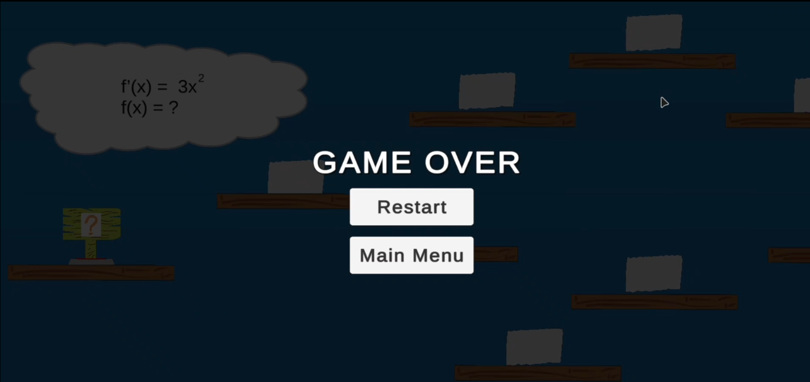
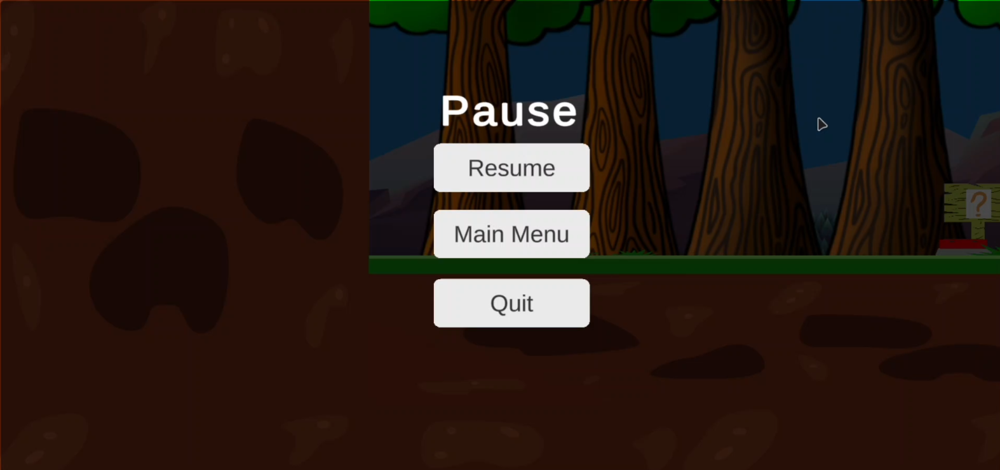
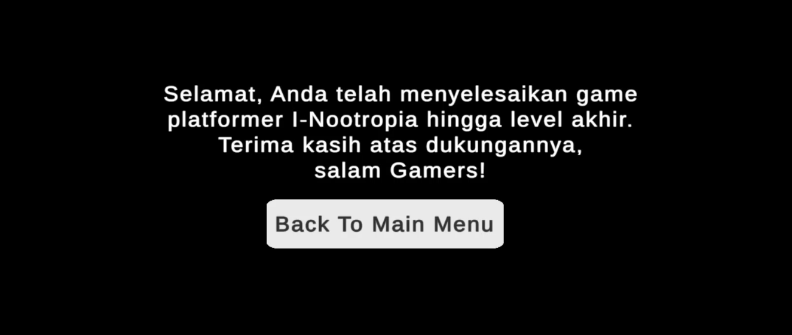

## Platformer (2D) Game I-Nootropia

I-Nootropia is a game platformer inspired by game "bounce tales" on Symbian OS, but on this game is running specifically on Android OS with minimum Android version is 7.0 (Nougat).
Not only that, on this game implemented a concept of gameplay with math inside it. The math in this case is mean a basic of calculus which includes basic of limits, basic of Derivative, and basic of Integral.
The game would be go to next level if the player have been success (Of course all answer are correct) clear all the calculus case.
With this game hope's it can be prevent someone from experiencing brain fog (a condition where someone experiences feelings of confusion, forgetfulness, and reduced concentration and clarity of thought).

## Methodology

On this development game, **Multimedia Development Life Cycle** is used for the methodology because it has clear steps, focuses on using multimedia, allows testing and changes, and ensures the game is fun and easy to use.

 

 

 Based on that picture the steps is only until **Testing** , which is:
 
 **1. Concept**  
Observing the STT Wastukancana campus to create a fun and productive game concept.

**2. Material Collecting**  
Collecting primary data through observation and secondary data like multimedia content for the game.

**3. Design**  
Creating use case, activity, and class diagrams to plan the game’s structure, look, and requirements.

**4. Assembly**  
The game is built using Unity to allow interaction with users from various groups.

**5. Testing**  
Testing the game’s displays: main menu, guide, environment, game over, pause, and finish.

## Game Overview

 

All the features of the game **I-Nootropia** are working well, including the math challenge buttons, progress information during gameplay, and the display. Hopefully, this game can be improved further, especially in the environment and difficulty.
